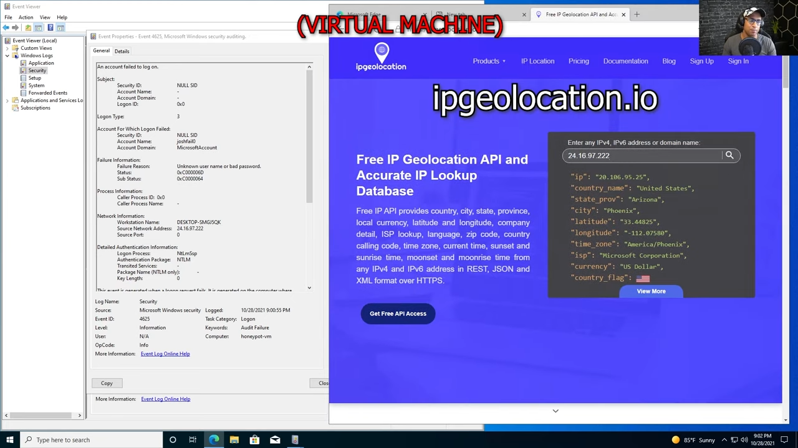
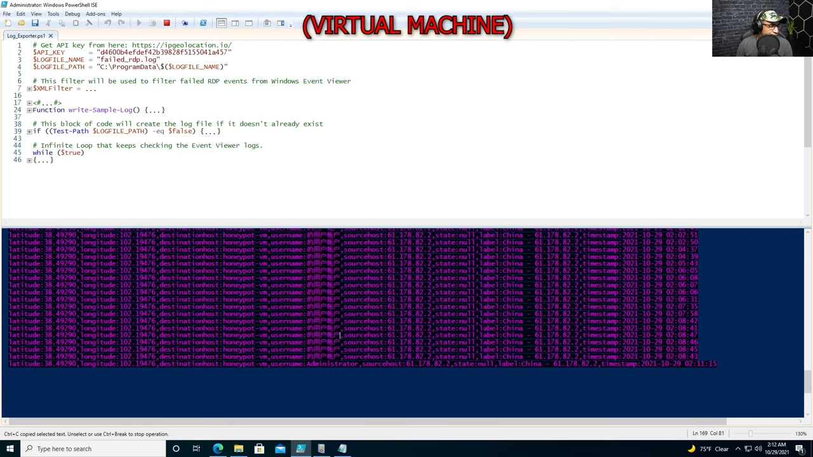
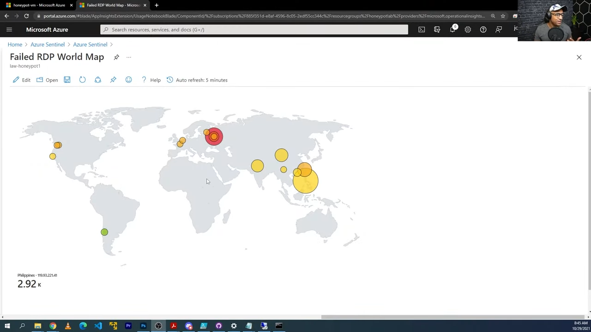

<h1>Failed RDP to IP Geolocation Information</h1>


 
<h2>Description</h2>
In this lab, I setup Azure Sentinel (SIEM) and connect it to a live virtual machine acting as a honey pot. I observed live attacks (RDP Brute Force) from all around the world. I used a custom PowerShell script to look up the attackers Geolocation information and plot it on the Azure Sentinel Map! 
<br />

<p align="center">

</p>
<h2>Languages Used</h2>

- <b>PowerShell:</b> Extract RDP failed logon logs from Windows Event Viewer 

<h2>Utilities Used</h2>

- <b>ipgeolocation.io:</b> IP Address to Geolocation API

<h2>Attacks from China coming in; Custom logs being output with geodata</h2>

<p align="center">

</p>

<h2>World map of incoming attacks after 24 hours (built custom logs including geodata)</h2>

<p align="center">

</p>


<!--
 ```diff
- text in red
+ text in green
! text in orange
# text in gray
@@ text in purple (and bold)@@
```
--!>
